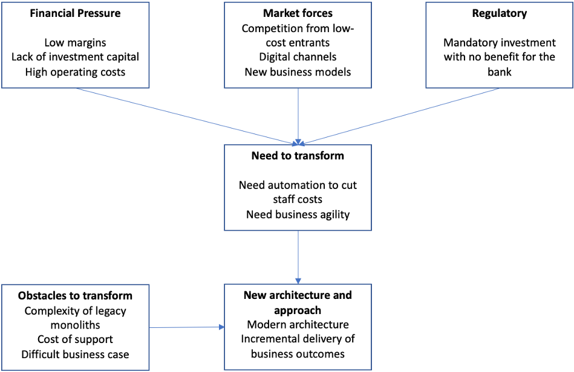
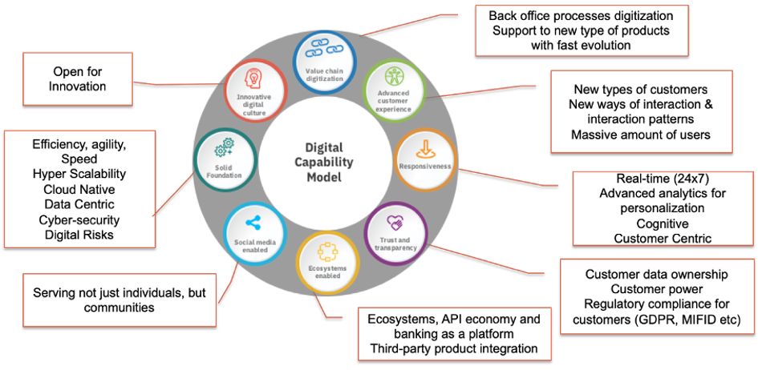
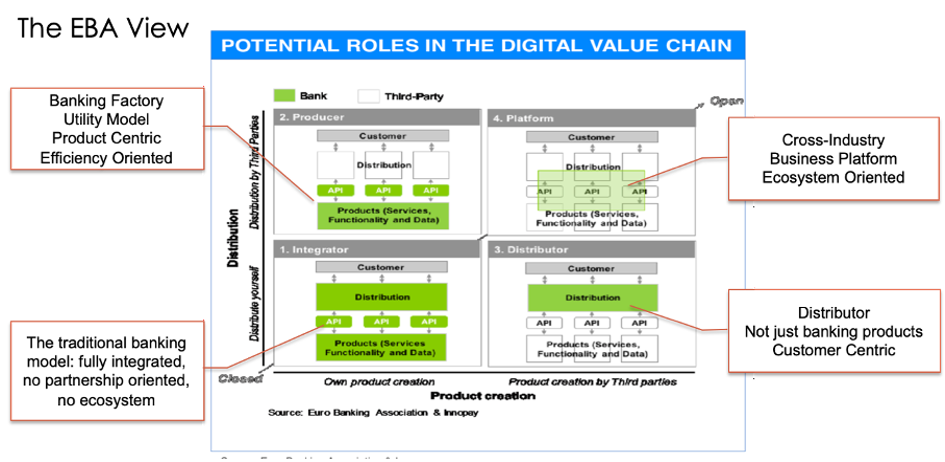
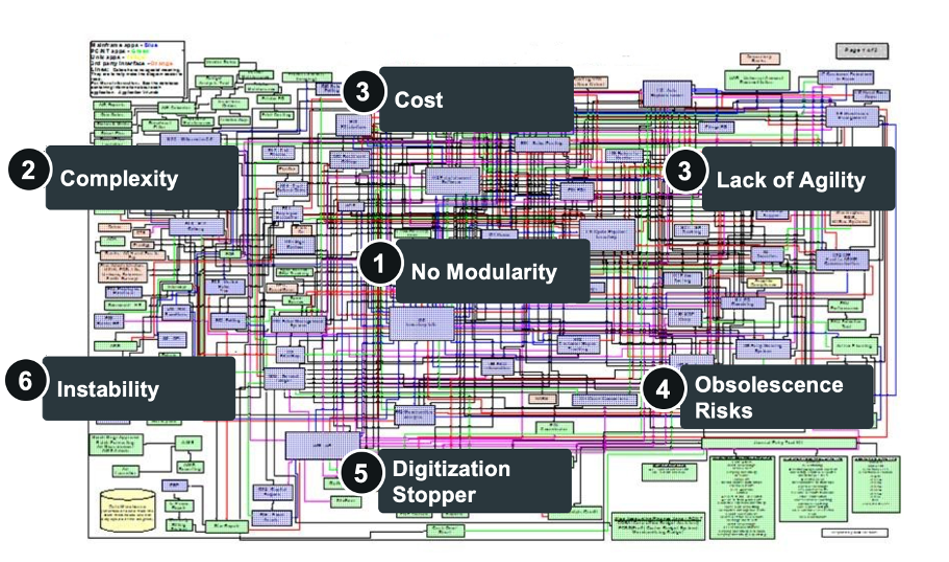
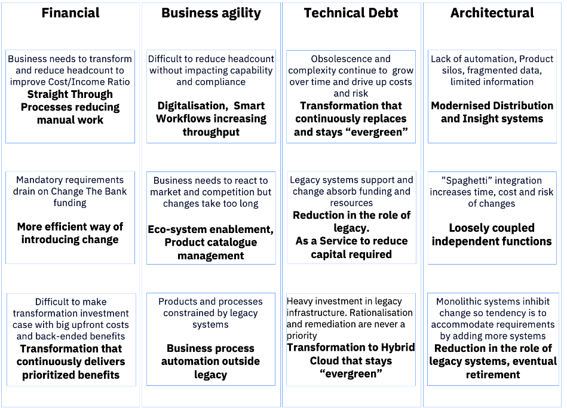

# Context & Lansdcape (Why)

The incumbents’ banking systems are currently under a great pressure to evolve due to a number of forces that are obligating banks to face deep transformations to support the business requirements. 
  

**Technology disruption**, in all the different domains, like unprecedent computer power, architectural models (microservices architectures or blockchain among others), new data base models (like the NoSQL generation requiring new data architecture paradigms to manage massive amount of data) or AI (to create actionable insight and extreme automation), facilitated by new consumer models like cloud, are opening new opportunities for the banking information systems, but also for **new players**, like new challenger banks (eg. N26, Fidor), niche providers (PayPal) or the BigTechs or GAFAs (Google, Apple, Facebook, Amazon etc.) that are attacking specific areas of the traditional banking business.  Due to the legacy nature of the incumbents’ systems those technological innovations cannot always be adopted for business benefit.

**Regulation** is creating a massive pressure in the banks’ budgets and IT departments resources just to follow regulatory requirements that in principle do not provide any competitive advantage or increase in revenue or profit. These requirements are demanding heavy changes in the heart of the banking legacy systems, mainly in the data and transactional architectures and processes that are not currently open and flexible enough to provide the required information (data linage and traceability, difficulties to expose legacy transactions as PSD2 APIs, etc.). Even though the 2007-2008 financial crisis is over the effects on banks is they have had to build up much more Tier One capital at the expense of investments.

**Market pressures** continue with the current COVID-19 crisis. Interest Rates are at historic lows and the Yield Curve is unfavourable for the short term borrowing/ long term lending business model of banks. It does not seem that the banking sector can come back to the margins the used to have before the crisis. and the pressure on costs and profit is here to stay.

Regardless the bank LoB, business model and strategy the efficiency (cost to income ratio) is a key variable to be tackled and reduced as much as possible using technology and organizational models that allows high levels of automation all the bank process, from distribution (on boarding, KYC, origination, etc) to production (back-office processes, fraud, etc). Again, the nature of the very legacy systems prevents in many cases the adoption of technologies (like business process automation or AI and cognitive) that would support higher levels of automation improving the bank efficiency

All of those previous factors and others like the power of customers that are now in many cases digital native and demand the high levels if usability and convenience, are driving very quickly a deep and holistic digitization process that requires new digital capabilities impacting in all the dimensions of the bank operating model, as it is shown in the IBM Digital Banking Framework (DBF)

 

Finally all those factors and regulations like PSD2 and Open Banking are forcing the banks to find **new business models** in addition to the current vertical integrated one, where the bank can play other roles like a factory of financial products and services, distributor of financial services (or even other industry products) from third parties or become a really platform where create new customer experiences involving with partners and a whole ecosystem of participants, as it is shown in the next figure from the Euro Bank Association. 
 

On the other hand, the banking business requires higher levels of **efficiency, agility, flexibility and openness**. Most of the incumbents’ legacy systems are not prepared to support those requirements, needing to evolve in a stepwise way towards to a Next Generation Architecture, that will be explained in the rest of this document.

The fundamental challenges of the banks’ legacy systems to support the new markets forces and business requirements are summarized in the next figure: 

A key problem is the **lack of modularity (or componentization)**: the system is the result of decades of fixings and patching creating layers over layers of an old core system, resulting on a extremely complex monolithic structure with a number of silos, that has created an uncontrolled (and unknown) hyper-integrated model of processes, data and transactionality. This lack of modularity causes any change to require a deep and long analysis of the connections among the affected part and the rest of the system and costly regression tests. These is an impact on the agility to move from the customer needs and requirements to the system in production. This causes as well high costs of development and maintenance and obsolescence risks, due to the difficulties to update the system and replace outdated middleware, and systems instability, being all of them a strong and impassable stopper for the banking digitization process.

**Lack of Modularity** is a key problem for the legacy banking systems, and a stopper for new delivery models that requires loosely coupled systems like cloud. 

There are many obstacles that prevent banks from being able to carry out radical transformation programmes, as illustrated in the following diagram:
 

There are severe problems with making a Viable Business Case for transformation, which is the reason these issues persist:
* As discussed above there are other mandatory calls on investment funding
* Technical debt and obsolescence continue to drive up costs and operational risks
* Legacy systems continue to absorb available funds and resources as they are so hard to maintain
* An IT-led transformation inevitably incurs large up-front costs for back-ended cost savings.

The net effect is the best that most banks can manage is tactical projects that further increase the complexity of the portfolio. The Next Generation Architecture is focused to tackle these problems - creating systems that are highly modular and flexible, adaptable to a continuous fast changing banking environment and architected in a manner that allow a phased migration from legacy which regularly delivers incremental benefits to justify the investments required. 
As illustrated in the following diagram, these enable overcoming the Transformation obstacles described above:

