# Guidance - Metamodel for Service Model Design

## Business Architecture

The following is a recommended metamodel for Business Architecture design.

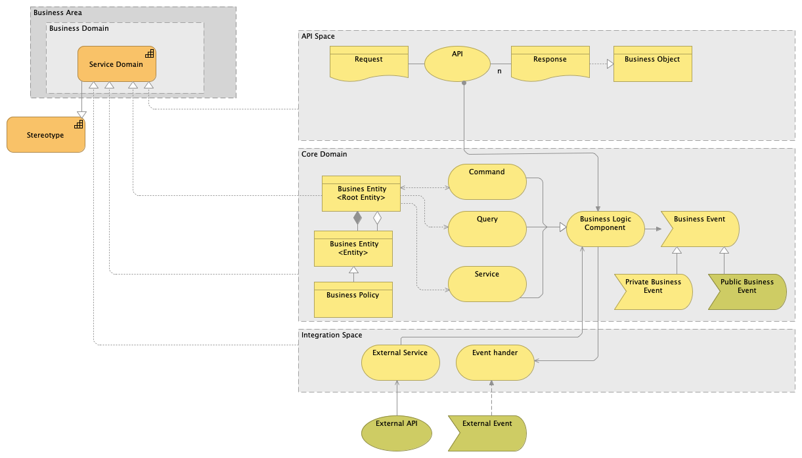

We follow the Domain Driven Design (DDD) recommendations and adopt a Hexagonal Architecture Style.
In the Hexagonal Style we isolate the core of the domain from the integration aspects of the domain. 
A proper integration to achieve high levels of operational modularity is a key aspect of the design, specially in microservices architecture with the microservices to be deployed in cloud infrastructure where the operational modularity is a must for the system.

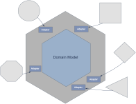

With the Hexagonal Style we pursuit to:

* isolate the business logic of the domain of data structures from other domains;
* isolate the business logic from integration logic at the domain level. Changes in the interfaces do not affect the business logic and therefore provides development modularity (few dependencies for greater agility);
* isolate the business logic from the technical platform. Changes in the technical platform will not impact the core business logic of the domain;

The hexagonal style is reflected in the high-level design on our Services in a 3-layer structure with clear separation of responsibilities:

* **Core Domain** contains the domain business logic and data structures; The Core Domain is described by:
    * Aggregates, data structures used to organize the information used and managed in the domain. Entities and Value Objects are used to structure the aggregates.
    * Commands. Components to create and manipulate the data in the domain.
    * Queries. Similar to commands, but with the purpose of retrieving data, while commands responsibility is to create or alter the data.
    * Service. Encapsulation of business logic for reusability or whether it is complex, and we do not want to place complex logic in the commands.
    * Domain Event are used to publish information on changes in the states of the domain aggregates.

* **API Space** implements the APIs exposed by the Domain. This layer does not contain business logic and isolate the application from future changes in the integration styles, when a new standard replaces the Rest API;

    The API layer never implement business logic, but uses Commands, Queries and Services to access the data and business logic implemented in the Domain.

* **Integration Space** implements the access mechanism to data and services in other domains. Its main purpose is to transform the data received from other domain via APIs or Event to the domain language, this means to the data structures of the domain. The business logic is built exclusively using the domain data models and never data models of other domains (i.e the payload structures of the consumed APIs);

Components in the Core Domain uses external services to access data or services in other domains, as was described in the Core Domain section of the document.

Event Handlers use Commands and Services in the Core Domain to alter the domain aggregates as a result of an External Event. For example, an event informing in the change of the status of a credit offer may trigger actions in the Customer Request domain, for the customer requests related to such credit offer.

## Application Architecture Metamodel

Application Architecture describe the IT solutions that will support the business architecture.

A service domain can be implemented using different types of solution. The following diagram shows some of them

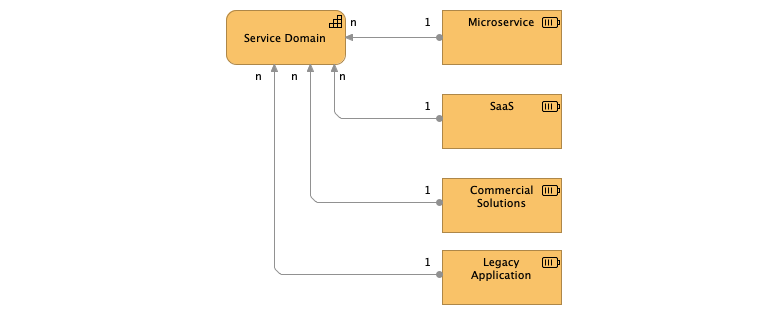

It is important to notice the cardinality. By default, and as a principle, a service domain should be a self-contained component, hyper-modular. In consequence, there should be 1 to 1 relationship between service domain and the applications implementing the service domain. In real life, a solution can support more than one service domain. What should never happen is to split a Service Domain to more than one applications, because this would mean that this Service Domain could have been split into smaller Service Domains.

# Elements in the Metamodel

### Business Areas

Banking Processes are usually complex processes, where different actors intervene and where each actor has very different objectives to fulfill: there are commercial processes with client managers who wants to sell products, customers who need financing, deposits or manage investments but wants requests to be resolved quickly and in the simplest way; there are risk managers whose imperative is that the operation complies with the established Risk Policies; there are legal and internal audit departments obsessed that the signed contract is valid and does not give problems in the future; back office manager, who seeks to process operations at the lowest possible cost; a regulatory compliance officer who does not want sanctions on the bank for non-compliance; and so on.
How is it possible to reconcile such disparate and often conflicting interests in a single process? Who is the owner of each process? Can someone who design a process really put himself in the shoes of all the actors or is he always going to favor the objectives of one of the parties? 

The Business Areas structure the business capabilities in large blocks in the value chain. Business Areas must be very independent from each other because each area has different business priorities and imperatives and requires very different skills. No teams should own responsibilities in more than one area. Dependencies between applications in different area should be minimal to none.

The following diagram includes the business areas according to BIAN v9 and enumerates the different business imperatives that each business area usually aims.

### Business Domain.

Service Domains are grouped in Business Domains. They represent responsibility groups, which provide similar related capabilities so that teams can specialize in specific knowledge areas, and which share a common business language. They represent a reference model for possible IT reorganizations. For practical purposes, you should have a single head of the IT organization.

Business Domains subdivide the areas into groups of domains that provided related business capabilities and share a Common Business Language, SMEs and IT Development Teams. 

For practical purposes, they should be owned by a single manager within the IT organization (and desirably, within a business units).

While the business areas will usually follow the model proposed by BIAN, the Domains will differ greatly, to adapt to the reality of each Financial Institution.

The IT organization should be designed to meet the business domains models, with different team assigned to different domains. The teams can them specialize in specific knowledge the domains require.

### Service Domain

Business Domains are structured in Service Domains. Each Service Domain has a unique business purpose, are elemental (not composed of other Service Domains), and collectively comprehensive (any business activity can be model using Service Domains).

Services Domains that implement business capabilities under the principle of single business responsibility. They expose the business capabilities using APIS or public business events. Interactions and collaborations are implemented between service domains, while business domains remains an organization and governance element.

Service Domains are implemented, integrated, deployed and/or consumed as Self-Contain Systems. They provide business capabilities exclusively through standard API and Business Events. A Service Domain can be implemented using any kind or combination of technical solution, from application servers, BPMaaS, IA solutions, etc. Service Domains do not share data nor transactional contexts with other domains.

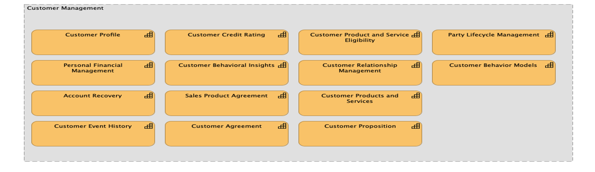

### Stereotype

The service domains follow stereotypes. This helps to standardize the design of the different service domains into few types and improve the reusability of components, accelerates the design and implementation and improve the learning curve of the developers and designers.

A service domain should have only one Stereotype. If more than one stereotypes are required to describe a SD, spliting the SD in different smaller SD should be considered. The stereotype defines the type of responsibility of the service domain. SDs with the same stereotype will have similar structure. Typical Stereotypes are:

- Registry or Repository
- Assessment
- Process
- Accounting Unit

Example of registry sterotype:

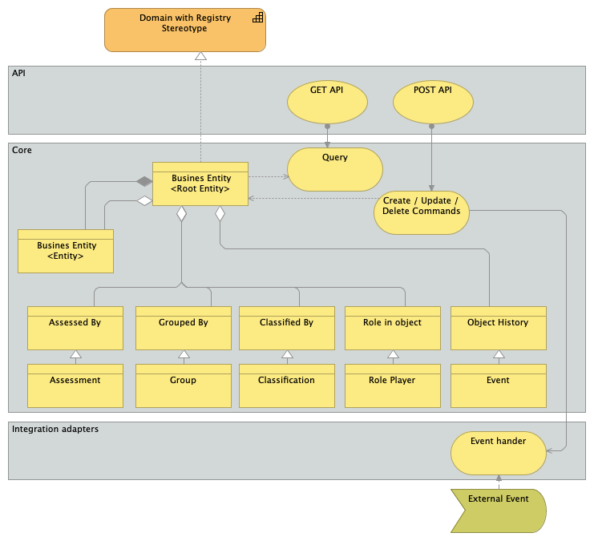

See [Guidance: Specification of Stereotypes for Service Domains](service_domain_stereotypes.md) for further details

**Equivalence in BIAN Metamodel**
The equivalence in BIAN to the Steretype are the **Functional patterns**. You may want to create specific stereotypes to design each service domains for each different functional pattern in BIAN.

### API

The API exposes the data and services provided by a service domains to external consumers.

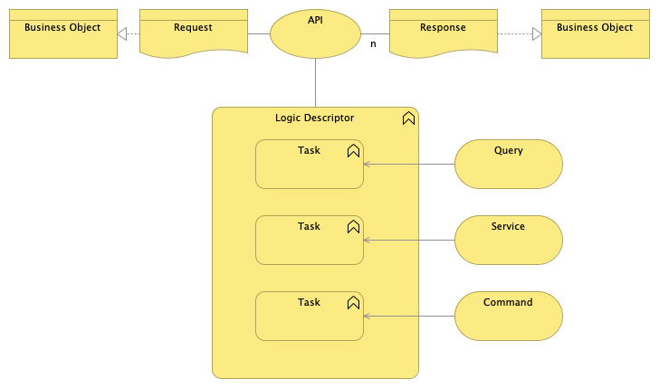

API exposes the business services and domain data through Commands, Services and Queries, which implement the busines logic of the service domain.

### API Requests 

The API Requests models the data received by API.
 

### API	Responses

API responses describes the potential responses provided by an API. They are usually normalized.

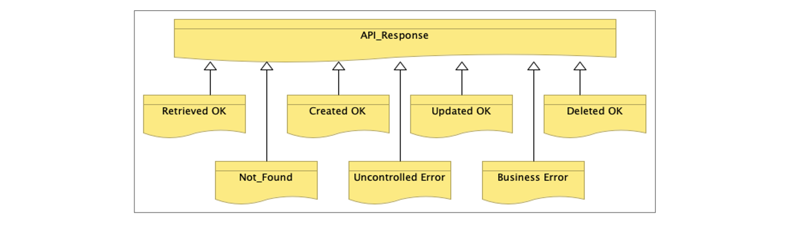
 
 
API responses and requested are modeled as Business Objects, following the same approach. Please see the “Business Objects” sections of this guide.

### Aggregates

Aggregates are the elements used to model the information managed or use within the domain and provides the ubiquitous language of the Domain.

The following is a model for an aggregate structure.
 
An aggregate is made or a root-entity and includes other entities.  

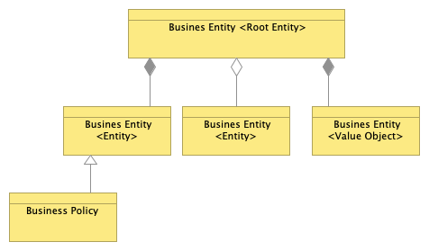

The Aggregate and Entity are further described through their lifecycle. They describe the allowed transitions between states and the pre-conditions (constrains) for such transitions.

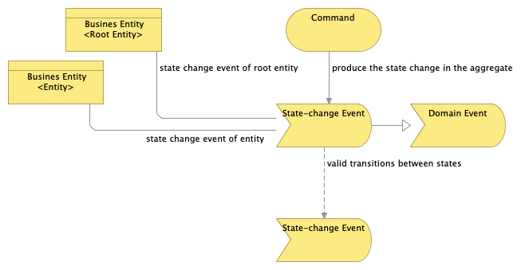
 

**Equivalence in BIAN Metamodel**
The equivalent of the Aggregate (which is a DDD Concept) in BIAN is the Control Record and Behaviours Qualifiers. The Root Entity in DDD would be the Control Record in a BIAN Service Domain description while every Entity under the root entity would be a Behavior Qualifier.

### Commands

Commands are the business logic components in charge of creating or modifying the data in the aggregates. They are called whenever new data has to be persisted in the domain.

The commands (such as the queries and the services) implement the business logic in the domain. Logic is described in Logic Descriptor elements. We also create flows using Task elements to provide clarification. We use specific Tasks to detail the mapping instructions to the interfaces of the services called.

Next picture shows the model for the Command description. It the picture we can see:
* Interfaces of the Command (input / outputs) are described using entities;
* The first Task describes a step when we are retrieving data from an aggregate or an entity (i.e retrieve a “Policy Criteria” using the Criteria ID…);
* The second Task describes a step when we are calling an External Service. The task description should provide the necessary instructions to explain to the designer how to call the service (how to populate the input interface of the called services) will be done;
* The third Task describes a step when we are calling a Domain Service. The task description should provide the necessary instructions to explain to the designer how to call the service (how to populate the input interface of the called services) should be done;
* The fourth Task describes a step when we persist data into the domain. The task description should provide the necessary instructions to explain to the designer what entity is created, updated or deleted;
* The last Task generates a Domain Event. The task description should provide the necessary instructions on how to populate the information required to create the event.

 
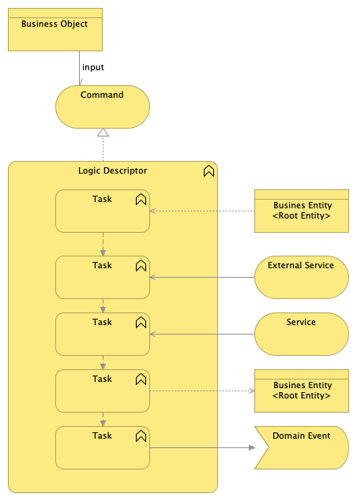

### Service

Services are the Business Logic Components where we encapsulate business logic to be reused or when it is very complicated and we do not want to add complexity to the Commands. 
  
The services implement the business logic in the domain. Services are modelled like the commands. Please refer to the previous section for details on Command modeling. The only difference is that Services cannot persist data. This is exclusive of Commands. Services uses commands to alter the aggregates in the Domain.

The next picture provides a model for Services:

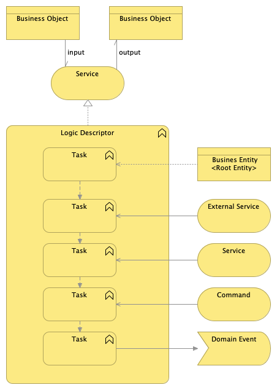

### Query

Queries are Business Logic Components used to retrieve data based on different criteria. We only need to define a query component when we face non-standard access requirements (different of GetByID or GetAll). For example, to retrieve customers which belong to a specific group.
    
Queries are modelled like the Services. Please refer to the **Service** elements above for details on Service modeling. The next picture provides a template for Queries realization diagrams:

 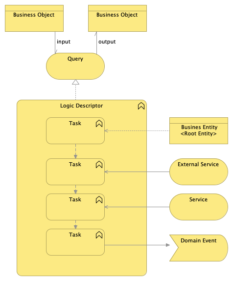

### Domain Events

Domain Events are the business events emitted by the Domain.

Domain Events can be private or public. Public events are used for other domains to subscribe to changes in the resources of the Domain. Private events are used within the domain to apply reactive archiecture designs.

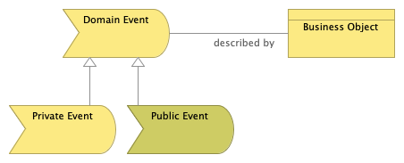

### Business Object

Business Objects are used to describe data structures in general. They are used to described inputs / outputs of services, commands or APIs, or Entities in Aggregates.
 
Next picture is the sample for Object Structure View:

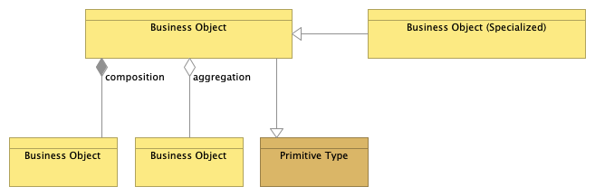

In the diagram, we use composition relationship for single atributes and aggregation relationships for collections but this can change dependending on the modelling tools used. Actually composition usually would denote objects that have not meaning in contexts other to the business object they compose, while aggregations denoted business objects with actual identitity that exists by themselves our of the context of the business object they are aggregated to.

Businsses Objects contains attributes. Attributes can be primitives’ types or other objects.

To define the structure, we use aggregation and composition relationships as can be seen in the picture. We use composition for single objects and aggregation for collection of objects, when an object contains not a single, but a collection of objects in one of the attributes.

Non-object attributes must be subtype with a primitive, for example the Start Data with a Data Primitive in the following figure with a sample. A not-subtyped is understood to be a complex object. 
 

 

### External Events

External Events are business events published by other domains that trigger any kind of response in our Domain.

For example, an event informing in the change of the status of a credit offer may trigger actions in the Customer Request domain, for the customer requests related to such credit offer
 

### Events Handler

Event Handlers are components of the domains responsible to receive the event and use the information contained in the Event to trigger actions in the core domain, for example, to update information in one of the aggregates.
  
Event Handlers are modelled like the Services. Please refer to the **Service** elements above for details on Service modeling. The main difference with services is that even handlers do not emit Domain Events.

The next picture provides a model for Event Handlers:

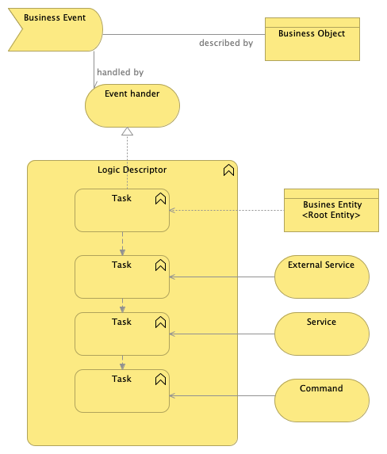

### External Services

External Services are the components of the service domains responsible to access information of Services in other domain, by calling the APIs of those domains. 

The External Services´ main responsibility is to transform the data received to the “ubiquitous language” of the domain, which means to provide the information in the structure defined by the aggregates of the Domain. This is done to avoid the business logic to rely in data elements proprietary of other domains, which would mean a strong coupling element.

The next picture provides a model for External Services:

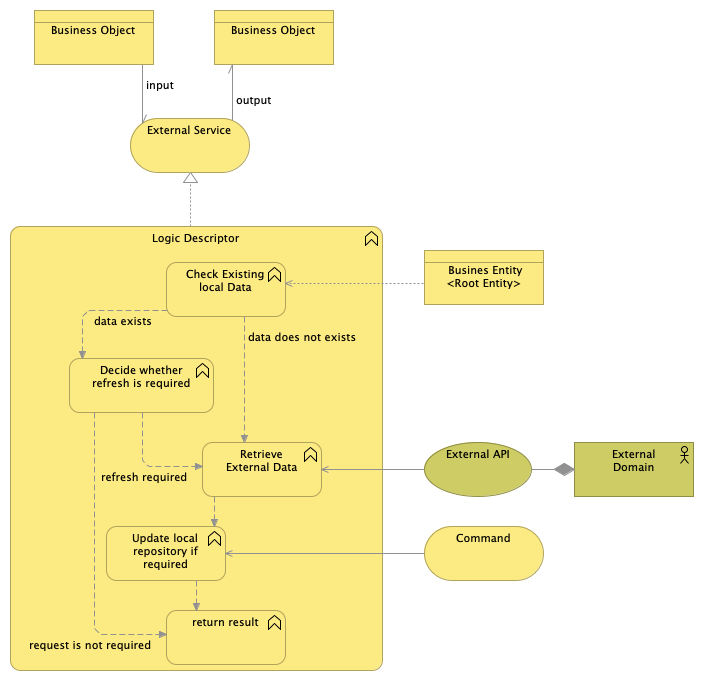

### External API and External Domains

External APIs are services provided by other domains that are used by our domain to obtain data or request a service. 