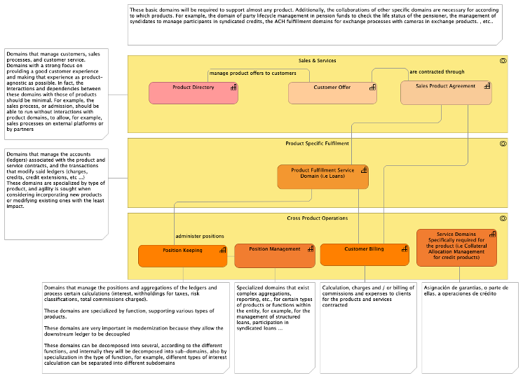
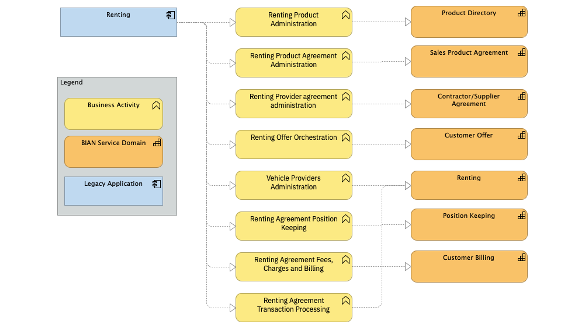

# Application Portfolio Business Analysis
In the first activity, every application in the Application Portfolio is analyzed. This means that the functions and responsibilities of each application are identified at a high level and each function is associated with the service domain that, according to BIAN, would be responsible for it.
Identifying functions that are repeated in several applications and associating them to the same domain enables the identification of opportunities for reuse and standardization.
When distributing responsibility by domains, the specialization of the teams responsible for the domains is encouraged. 
In most of the legacy applications, there will be a one-to-many decomposition of the application based on the function that it implements. Having one-to-one mapping of application to service domains is usually a sign of poor analysis or understanding. 

[Guidance: Decomposition Patterns Reference](guidance/decomposition_patterns_reference.md) describes several typical descomposition patterns that can be applied during this activity. For example, for any product applications (i.e deposits, loans, credit cards) you can use the "Product Silo Decomposition" as a guide to identify the typical functionalities in this type of applications and find the target Service Domains in the Reference Model.

The following is an example of the Product Silo Decomposition Pattern:

The following is an example of applying the Product Silo Decomposition to an application managing renting products:

| Task | Description |
|:--------------|:-------------------|
| **Capture Application Information** | - Obtain Apps Description    - Obtain Apps Dependencies    - Obtain Apps Organization/Roles |
| **Decompose Application into Business Activities** | Identify the different Business Activities supported by the applications. |
| **Map Business Activities to BIAN Service Domains** | Map the business activities for each application to the BIAN Service Domains that would provide such capabilities in the target solution. |

