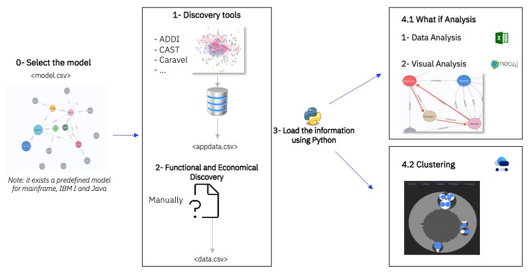

# Application Portfolio Technical Analysis

The purpose of this activity is to analyze the existing applications to calculate the technical dimensions that will be used as inputs to create the disposition recommendations, the target solution and the transformation roadmap.

The analysis is usually done applying code analysis tool to the code base, and extracting the elements (programs, classes, databases, batch processes, files…) and the relationships between them.

The type of element to identify depends on the type of applications. For example, for IBM Mainframe we would identify Cobol programs, copies, JCLs, IMS transactions, CICS Transactions, DB2 tables, while for a system built on Java we would identify classes, libraries, interfaces, etc.

The elements are grouped together in clusters, and each will be classified functionally and mapped to the target architecture, so that there is a linkage of current and target architecture and an analysis of what components in the current systems would be transformed into each of the components in the new one. For example, a cluster of components supporting product configurations would be mapped to the “product directory” domain in a target architecture based on BIAN standard. When the target architecture is not available when completing the analysis, the mapping can be postponed to further stage of the projects but, at least, a functional classification should be done at this stage to facilitate the later mapping.

The clusters of elements are then analyzed, and technical dimensions are extracted. We are especially interested in:
-	Complexity (measured through some standard metrics).
-	Coupling (how dependent is the cluster with other clusters based on the number and type of interfaces).
-	Open Standard (whether the clusters is developed on open standards or whether it is dependent on proprietary languages, runtime components, libraries, etc.).

The clustering of elements can be done manually or using algorithms.
-	Manually, usually based on naming conventions or information provided by the owner of the source code. Legacy systems are usually structured in applications and have naming convention to know the application owning a program or a dataset.
-	Automatically. advanced analysis tools, such as [Cumulus](assets/documents/cumulus_description.pptx), will provide algorithms to optimize the clustering so that the resulting ones minimizes the dependencies with other clusters. The modernization of a cluster will be much easier as smaller is the number of the dependencies.
-	Hybrid. Start with a high-level clustering based on naming standards or other mechanism and refine with automatic analysis algorithms.

The outcome of the activity would be the source code structured in clusters and each cluster classified technical and functionally. This outcome will be later combined to business dimensions (TCO, Operational Cost, revenue objectives, etc.) to apply the disposition rules and create transformation strategies for each of the clusters.

| Task | Description |
|:--------------|:-------------------|
| **Create analysis model** | First, the model to be built must be selected depending on if it is a Mainframe, an IBM I or a Java program. The type of element to identify depends on the type of applications. For example, for IBM Mainframe we would identify Cobol programs, copies, JCLs, IMS transactions, CICS Transactions, DB2 tables, while for a system built on Java we would identify classes, libraries, interfaces, etc.   The model will inform the analysis of what elements they have to extract from the analysis tools. If they are analyzing a Mainframe systems in COBOL, CIC, DB2, the model will require elements such as programs, JCL, DB2 tables, files, or CICS Transactions to be found and extracted, together with the relationship between them. |
| **Extract and normalize relevant elements from the base code** | In the Application Discovery, the first part is identifying different technical information such as:   - Nodes or information **objects**   - **Properties** of each type of objects   **Type of relationships** between objects   The technical analysis allows to have a technical representation of the customer application portfolio, that will be used to apply “What If” studies of Cloud Modernization; these studies will help to determine the difficulty, cost, and time to be invested to achieve the purpose of modernization and thus determine the best strategy to migrate mainframe applications to Cloud.   This phase allows to create a technical map of the full portfolio, identifying the software components (nodes) and the relationships between them.   Therefore, technical discovery tools, such as ADDI, CAST or Caravel, are used to provide a map of relationships between the technical elements (such as Jobs, Physical files, Batch processes, Databases) that make up the customer’s IT systems. The technical discovery can be done in Mainframe Systems, IBM I, Java Programs…  All the information is saved in csv files.
| **Classify functionally** | The next step is researching the functional information of the business and the IT context in which the client is framed, information of the operation and structure of the analyzed systems. It is possible to generate a functional layer on which all the technical components are supported (Business Areas, Subareas and Applications). As in the previous step, all the information is saved in csv files.   After these steps, we have all the technical and functional information that will allow us to carry different analysis (What if Analysis, Clustering, etc):|
| **Clustering** |  A clustering process allow us to identify optimal group of applications with maximum inner coupling and minimum external coupling.   The clustering of elements can be done manually or using algorithms.   - Manually, usually based on naming conventions or information provided by the owner of the source code. Legacy systems are usually structured in applications and have naming convention to know the application owning a program or a dataset.   - Automatically. advanced analysis tools, such as [Cumulus](assets/documents/cumulus_description.pptx), will provide algorithms to optimize the clustering so that he resulting ones minimizes the dependencies with other clusters. The modernization of a cluster will be much easier as smaller is the number of the dependencies.   - Hybrid. Start with a high-level clustering based on naming standards or other mechanism and refine with automatic analysis algorithms |
| **Analyze Cluster and extract technical dimensions** | The clusters of elements are then analyzed, and technical dimensions are extracted. We are especially interested in:   - Complexity (measured through some standard metrics)   - Coupling (how dependent is the cluster with other clusters based on the number and type of interfaces)   - Open Standard (whether the clusters is developed on open standards or whether it is dependent on proprietary languages, runtime components, libraries, etc.) | 

## Guidance

* **tool mentor:  [Cumulus](assets/documents/cumulus_description.pptx)**
