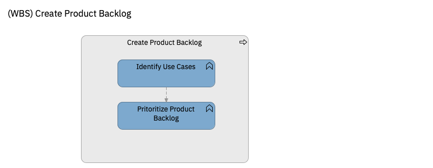

# Create Product Backlog

| Task | Description |
|:--------------|:-------------------|
| **Identify Use Cases** | Create a list of use cases. Alternativelly you can use Customer Journeys, Epics and User Stories instead of use cases.   The use case must be small enough to be described in an 1-hour event storming. The use cases can be incremental, one use case extending a previous one with a specific situation or requirement, so that they can be prioritized and handled for incremental delivery.|
| **Task: Prioritize Product Backlog** | Prioritize the use case in the product backlog so that they will be analyzed and designed in the most efficient order, beginning with the most simple, happy-path cases and extending it with new use cases adding complexity and exceptional situations.   The use cases should have been identified incremental. Otherwise, go back to the identification of use cases. |
