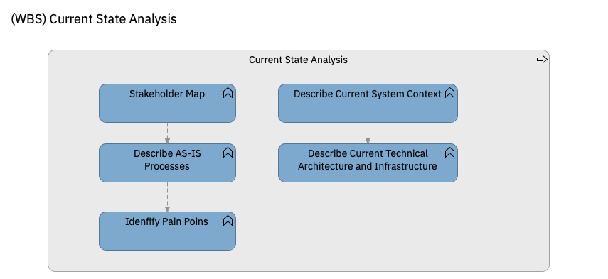

# Current State Analysis

| Task | Description |
|:--------------|:-------------------|
| **Stakeholder Map**| The stakeholders that are relevant to the process to be transformed are identified. These Stakeholders will help to understand the current processes and their most relevant steps, as well as their main functionalities and deficiencies. They will participate in the work sessions and will support and validate the definition of the transformation proposal.|
| **Describe AS-IS Processes** | The process to be transformed is described, identifying all the relevant information (which are the users and the applications involved...) of each part of the process. In this stage, interviews are conducted with stakeholders in which the most relevant business functions are explained and where existing documentation is reviewed to obtain the Customer Journey of the process and the functional capabilities of the system. |
| **Idenfify Pain Poins** | Identification of Pain Points (points of frustration in the use of the current application) and Business Gaps (business needs that are not supported by the current solution). This will allow us to obtain the current needs that will be used to empathize with each of the stakeholders. To classify the identified Pain Points, four categories are defined:   * MUST HAVE: top priority.   * SHOULD HAVE: would be very positive.  * COULD HAVE: not a priority.   * WON’T HAVE: not necessary.|
| **Describe Current System Context** | The relationships of the applications involved in the analyzed process and the reason why these applications interact with each other are identified. For this purpose, the software that makes up the AS-IS is reviewed to extract in detail the business functions it covers. Tools, such as Neo4j graphs, are used to discover the interrelationships of the current state components with the rest of the system components. |
| **Describe Current Technical Architecture and Infrastructure** | A map of the Technical Architecture and Infrastructure at a high level is created, identifying the most relevant components. It shows the different technical components and platforms on which these applications are executed or that support their development, as well as the programming languages used.|
