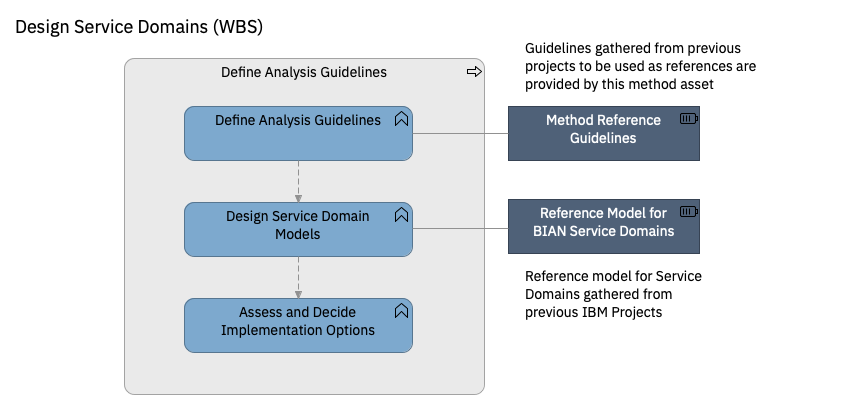

# Design Service Domains

| Task | Description |
|:--------------|:-------------------|
| **Define Analysis Guidelines** | Before going into proper design of the domains, create guidelines for analysis and business architectures of the different domains to follow common rules and apply best practices. Actual designs should later be reviewed for compliance to such guidelines by the design authority or architecture board in charge of architecture compliance. (See **[Analysis and Design](../analysis_and_design_guidelines.md)** practice for details) |
| **Design Service Domain Model** | Create Specifications for the elements in the service domains such as API, Commands or Aggregates following the [Specification Metamodel](../../guidance/model_metamodel.md) and using the Domain Design Template selected by the project.   Sub-tasks:   - **Select Service Domain Stereotype.**   - **Create Specification for Service Domain Aggregates.**   - **Create Specification for APIs.**    - **Identify and Create Specification for Commands, Queries and Services.**    - **Identify and Create Specification for Integration Services.**  - **Create Specification for Business Events and Event Agents** |
| **Assess and Decide Implementation Options** | A Service Domain Model, as defined so far, is a functional, technology agnostic model that can be implemented in different technologies. In this task, implementation decisions are made to decide in what technology each service domain will be implemented. If, for example, a service domain will be implemented with microservices, it will be decided the number of granularity of the microservices to implement the service domain.     Sub-tasks:   * **Define Implementation Decision Framework.** Create a decision framework with the options and criteria to decide on implementation options. The decision framework will contain critreria based on information relevant for the service domain such as Non-Functional Requirements, Business Criticity...   * **Identify Implementation Option for each Service Domain.** For each service domain, specify the information required to apply the criteria (for example: business criticity, NFR...)   * **Decide on Implementation**. Apply the criteria and decide and document the decision as an Architecture Decision.|

**Guidance**

* [Guidance: Service Domains Stereotypes](https://pages.github.ibm.com/BIAN-AOT-Initiative/bian-based-reference-domain-model/domain_models/service_domain_stereotypes/)
* [Guidance: Service Domains Specification Metamodel for Domain Driven Design](https://pages.github.ibm.com/BIAN-AOT-Initiative/bian-based-reference-domain-model/domain_models/model_metamodel/)
* [Guidance: BIAN Service Domains Reference Models](https://pages.github.ibm.com/BIAN-AOT-Initiative/bian-based-reference-domain-model/reference_domain_models/) provides examples of predesigned BIAN Service Domains
* [Guidance: Decompose Service Domains into Components for Implementation](guidance/microservice_identification_guidelines.md) 
