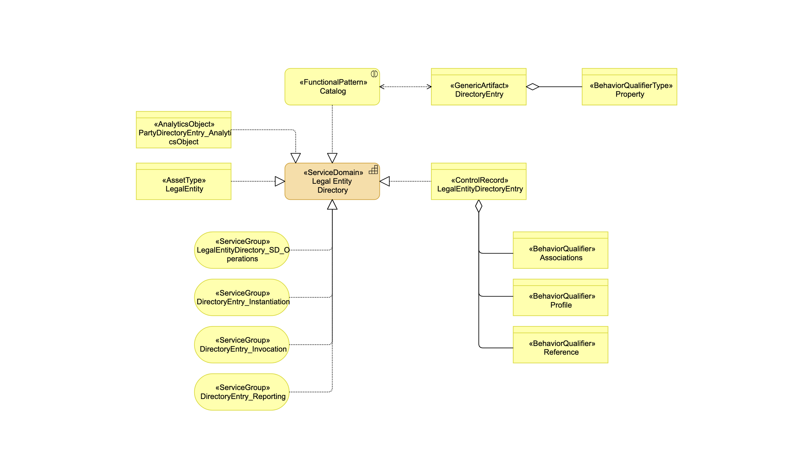
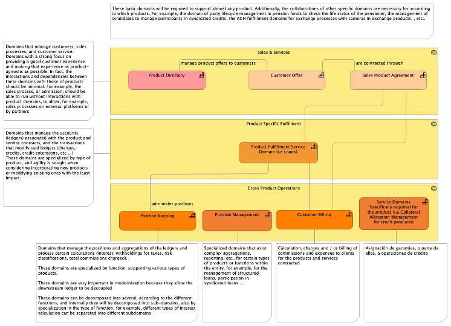

# Guidance: Identify the right BIAN Service Domains responsible for a business single capability

BIAN service domains are "generic business capabilities". They are the elementary building blocks that consume and expose the services used by the bank to provide business capabilities.

The Service Domains follow the priciple of "single responsibility", which means the sole responsibility to fulfill a specific business purpose. 

In Banking Transformation projects, when the target solution is being designed based on BIAN, the task of "mapping" existing or target business functions into the Service Domains that will provide such capabilities is a complex one, and usually badly performed.

This guidance aims to support the practioner in this task.

## Important Concepts: Functional Patterns a Generic Artifacts (Asset Types)

Each BIAN Service Domain has two important elements, the control record and the functional patterns. Both can be found in the Overview Diagram for each Service Domain, the following is an example of Overview Diagram.

The Control Record is comprised of all the business information governed by the Service Domain as it completes a full life cycle.

**The Functional Pattern**

The business role or purpose of a Service Domain is characterized by its Functional Pattern. BIAN has identified 20+ generic Functional Patterns that can be applied to assets. For example, the asset of a computer can be operated, an employee can be assigned, a relationship can be managed.   

A Service Domain is responsible for implementing its particular Functional Pattern on each instance of its associated Asset Type for the full life cycle.  So, for example, the Service Domain that 'manages' customer relationships is responsible for doing so for every customer relationship from the first time the customer is identified to the last time the customer has any involvement with the bank. 
 
Each Functional Pattern has associated a Generic Artifact, which classifies the Asset Types. For example, the Generic Artifact for "Allocate" Functional Pattern is "Allocation". This means that the Control Record in a Servide Domain with "Allocate" Functional Pattern would be a type of "Allocation".

The next picture shows the relationships between Functional Patterns and Generic Artifacts

Looking at the Control Record and Functional Pattern, we can ensure that we are assigning a functionality to the right Service Domain.

## Business Areas and Business Domains

The business area and business domain where a service domain is include, also helps to decide whether a service domain is the right responsible for a business capabilities

For example: 
* **Sales and Services** business area contains the service domains to support the product sales and the customer service domains. Most of the customer interactions are managed by the service domains in this business area and not on other business areas. One of hhe most typical mistakes when designing target solutions based on BIAN is to assign sales and services activities to product specific fulfillment service domains. For example, in most of traditional corebanking systems, the loan origination is a process managed by loan systems, which cover the e2e lifecycle of the loans. In BIAN, the loans service domains ONLY covers the fulfillment of the loan agreements, which start once the loans is signed and open. Everything that happens before the loan is signed and opened happens in sales and services domains, such as "sale product", "customer offer", "customer product / service agreements", etc.
* **Product Specific** domains manage the fulfillment of product and service agreements, since they are signed and open until they are closed or cancelled. The principle is to have a service domain per each different product or service. The business area also contains service domains not related to agreement fulfillment but that are specific for a type of products, mostly related to market operations. A trick to know whether a SD is the responsible for a capability, is that usually the bank get money from the services and product managed in this business area, via interests or via fees. In contrary, the services domains in **Cross Product Operations** don't provide incomes to the bank and only contain costs.

* **Business Support** has service domains required but not specific for banks or finanacial institutions, such as Human Resources, IT, or Document Management, which are capabilities common to any other Industry

## Decomposition Patterns

Other useful tools to identify the right service domain responsible for a business capability are the decomposition patterns. They provide guidance on how a traditional banking application providing a large set of functionalities is decomposed into generic capabilities provided by the service domains. 

An example of decomposition patterns could be:

and an example of the use of such pattern to identify the service domains to provide the required capability to support a banking product can be found in the following picture:

More information about decomposition patterns can be found in: [Decomposition pattern](decomposition_patterns_reference.md)
