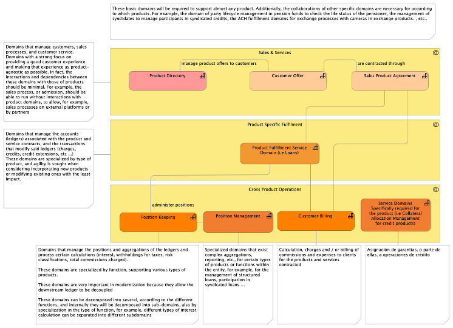
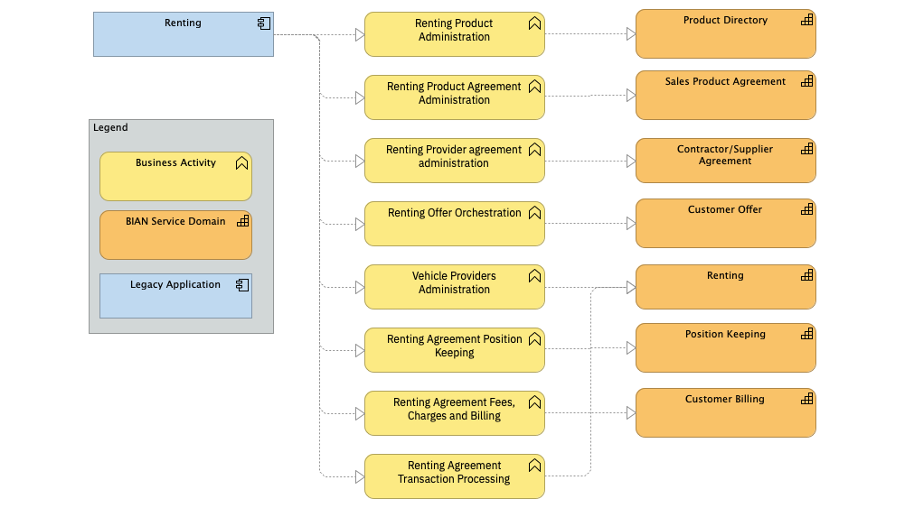
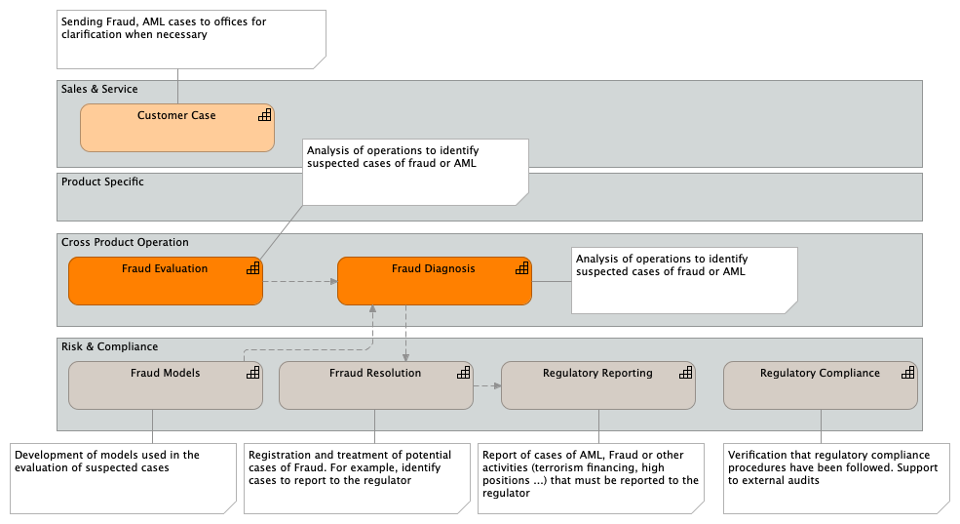

# Guidance: Decomposition Patterns Reference

 This guidance provide several typical descomposition patterns that can be applied during this activity. For example, for any product applications (i.e deposits, loans, credit cards) you can use the "Product Silo Decomposition" as a guide to identify the typical functionalities in this type of applications and find the target Service Domains in the Reference Model.

## Product Silo Application

Common applications in corebankig systems supports the entire life cycle of the products and can be decomposed following this pattern.

Example where this pattern is applied:

## Fraud and/or Compliance Applications Decomposition Pattern

Typical decomposition patterns for fraud detection, and internal o regulatory compliance applications

## Payment Related Patterns

This ["Payment Scenarios](https://pages.github.ibm.com/BIAN-AOT-Initiative/bian-based-reference-domain-model/domain_models/scenarios/Payments) provide a decomposition patterns for payment related applications.

## Loans Origination Related Patterns

This ["Loans Originatio Scenarios](https://pages.github.ibm.com/BIAN-AOT-Initiative/bian-based-reference-domain-model/domain_models/scenarios/Loans%20Origination/) provide a decomposition patterns for Loans Origination.
