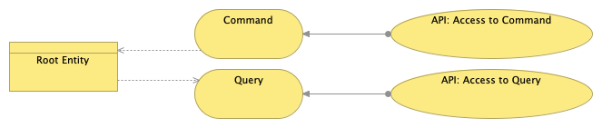
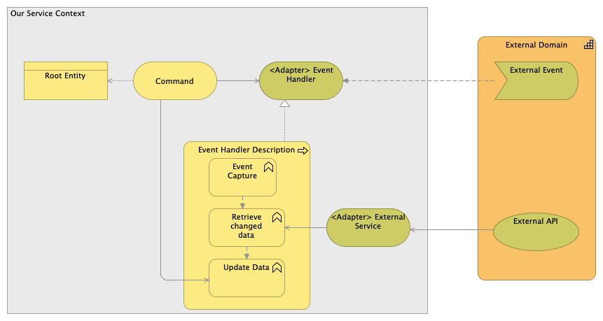
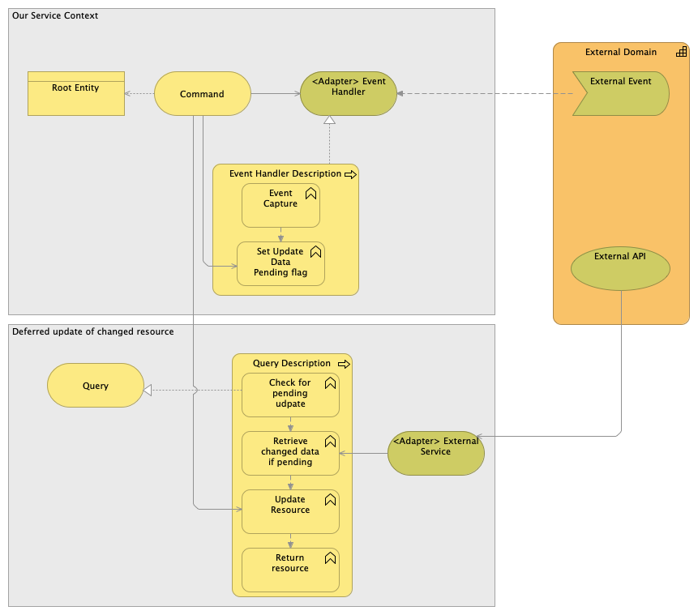
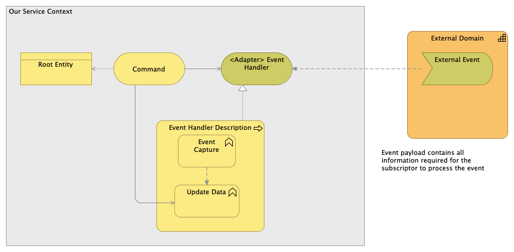
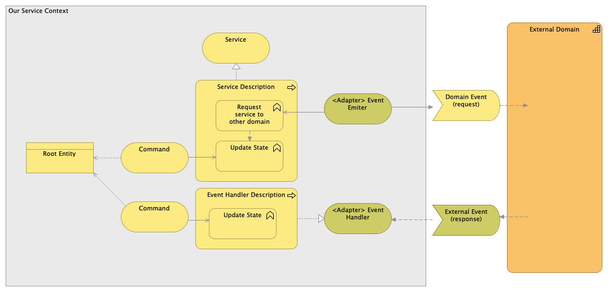

# Guidance: Integration Patterns and Specification Guidance

## Integration Patterns

### API Exposure

### Inbound File

### State Change Notification

When a microservice sends event messages to notify other microservice of a change in its domain. A key element of event notification is that the source microservice doesn't really care much about the response. Often it doesn't expect any answer at all, or if there is a response that the source does care about, it is indirect. There would be a marked separation between the logic flow that sends the event and any logic flow that responds to some reaction to that event.

The consumer of the event may required to enquire the source of the event for aditional data about the change in the resource, which is usually done through an API provided by the same domain publishing the notification event.

This mechanism is very low coupling and the preferred integration pattern for communications between service domains.

## State Change Notification, with deferred update

This is a variation of the State Change Notification pattern, where the resource is not updated after receving an state change notification, but when the data is going to be used. This is useful for scenario when a service A depends on resources of service B and changes in service B are more frequent than usage in service A, and when the Non-functional requirements in Service A allows for retreiving the change data in the moment of its use.

### Event-Carried State Transfer
When we want to update a microservices in such a way that they don't need to contact the source system in order to do further work. For example, a loan request microservice might fire off events whenever a customer changes the loan request (such as loan amount) with events that contain details of the data that changed. A recipient can then update its own copy of loan data with the changes, so that it never needs to talk to the main loan request in order to do its work in the future.

Event-Carried State Transfer implies a higher level of coupling between microservices, so that changes in the event structure may impact the consumer. This type of coupling constrains the ability to evolve and maintain the event provider.

However, this mechanism is more efficient than a pattern with Event Notification followed by the consumer of the event calling a RestAPI to gather the information not provided in the payload of the Event.

The architects should review and decide, in a case by case basis, the content in the payload for all Event-Carried State Transfer so that performance and coupling are properly balanced.

##	Command Events

A command is an instruction to do something. Typically, commands are directed to a particular consumer. The consumer runs the required command or process and passes back a confirmation to the issuer. The confirmation states that the command was processed. Commands Events are used, for example, in SAGA Patterns for a microservice to trigger actions in other microservices.

A simple example for a command event could when a microservice trigger an event for the Customer communication to send an SMS to the customer. The alternative to this pattern would be calling the customer communication API, but this mechanism would be synchronous and would couple operationally both microservices, impacting the performance and availability. With the Command Event, if the Customer Communication is not available, the SMS will be triggers once it becomes available, which won´t happen in the API usage scenario.

