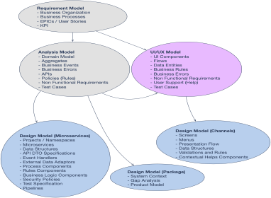

# Microservices Identification Guidelines - guidance - 

This guidance provides the guidelines to identify the microservices to be developed to provide the business capabilities described in the Service Domains.

The process to identify the microservices to be developed begins with the identification of service domains around the business capabilities required to implement the business processes and user stories. The highlights of the overall process are:

-	Business Consultant and Analysts create the “Requirement Model” which contains the description of business process, user epics and user stories.
-	Using the input of the “Requirement Model”, the Business Architects and Business Analysts develop the “Analysis Model”, which contains the domains, service domains, aggregates, events and APIs that will support the business capabilities to support the processes and user stories.
-	Using the Analysis Model as input, the application architects and designers create the Design Model. The design model will be the input to the development teams. The design model contains elements such as OS Projects, Microservices, API Specifications, Process Component Designs, etc.
Next picture provides an example of relationships between the different models in the application design processes:

 

The Servide Domains are elements of the business architecture and are agnostic of technology. It means they could be developed using different technologies. They are, however, important in the identification of the microservices they determent levels of isolation that should be respected by the microservices design.

Identifying the right servide domains, and also identify which microservice will implement each of the service domains is key for our target system to be easily and efficient to operated, maintained and evolved.

-	Smaller microservices makes the governance more complicated and increases the number of interactions between microservices.
-	Bigger microservice implementing several service domains may compromise the isolation of the  service domains, if several service domains are implemented in the same microservice. They also limit the ability to optimize resources based in the fact that different service domains will have different operational (non-functional) requirements.

This document provides the suggested guidelines to: 
1.	Identify business domains to cope with business requirements.
2.	Decompose the business domain into service domains.
3.	Identify the Microservices that will implement the service domains.

##	Identify domains and subdomains 

The identification of business and service domains will be exclusive decision of the Business Architecture (part of the Enterprise Architecture).

Service Domains are described via Aggregates, which are made of a Root Entity and several Entities.

Adding new Entities to an Aggregate can be proposed by the Domain Team but must agree with the Business Architect Team. It must contain an analysis and the decision whether the new entity would be “external data” (data managed in a different subdomain) and whether there is a need to identify a new service domain to manage this new entity.

The aggregate should contain all relevant information that the domain requires to implement the business logic of the domain, for example, all business rules that apply in the creation and lifecycle of an offer must the specified in the offer. If a system must be developed to manage the aggregates and provide the entire offering capability it will be pretty large. We also can see some entities that could be also relevant for other domains, such as agreements, products, documents, etc. The objective of decomposition activities is to decompose this domain into service domains, so we have several smaller service domains instead of big ones.
Small domains are better:

-	They have smaller footprint. If you use a microservice to implement a service domain, the smaller the microservice the lower the resources it will consume;
-	They are easier to maintain. Modifying small service domains requires less testing, and the risk to impact critical business capabilities is lower;
-	Having more domains allows us to assign different NFR to each one. This way we avoid spending resources in high NFR for non-core capabilities, just because they are together with a core capability;

The rules to decompose the domain into  service domains are:

1.	A service domain manages at least one resource. A resource is described by an aggregate or entity. If there is no “resource” whose lifecycle is managed by the service domain (such as the Control Records in BIAN Service Domains), there is no service domain. This is important because there is a lot of people creating microservices whose only purpose is to access some business capabilities in the legacy. They are named “anemic microservices” because do not provide any real business capability and they are just integration pieces. These “microservices” are not implementing any Business Capability;

2. A Service Domain should follow a single [Stereotype](../../../../domain_models/service_domain_stereotypes.md). If more than one steretype is needed, the Service Domain can surely be split.

3.	Service domains are as small as possible. There are not too-small Service Domains. If a Service Domain cannot be further decomposed is because there are other constrains, such as:

    1. The service domain does not support a e2e business capability (it can be simple, but it must be a describable business capability that make sense by itself). For example, a domain can simply manage e-mail addresses. There  iisenough e2e business in this function to have a microservice for this;
    
    2.	The service domain supports a business aggregate that is contextual (only make sense in the context of the aggregate, do not have its own lifecycle and it´s not used in any other context). For example, a notary role in a loan. For each loan, it may be relevant the Notary where the contract was signed. But this notary information is not relevant anywhere else, so it may not justify its own domain. A Customer is also a role in the loan, but in this case, the information about the customer is relevant for other domains, and in consequence, there will be a different domain to manage the customers;
    
    3. There are transactional consistency requirement between two entities (i.e. movements and balances) In this case, both entities must belong to the same Aggregated and cannot be split into two different aggregated or service domains.

When we apply the rules to the example of Credit Offer Domain, we can decide that:
-	The “customer request” entity will be actually supported by the “Customer Request” domain;
-	The “customer” entity will be supported by the “Customer” domain belonging to “Customer Reference Data Management” Service Domain;
-	And so on…

## Identify the Microservices that will implement the service domains

Each Business Domain will be implemented as an indivisible unit in term of governance (there will be a single owner, so there is a single team in charge of all of the microservices in the Business Domain. The implementation of the governance mechanisms (who has visibility and have permissions to work with the software components within a domain) will be decided according to the capabilities provided by the development framework selected.

Assuming that there is no framework and that we will develop directly in OpenShift (OS), the recommendation is to create an OS Project for each Domain.

This means that the technical realization of a domain is a Kubernetes Namespace, or OpenShift Project.

The technical realization of sub-domains are microservices. 

The general principle would be to have one microservice for each service domain. But there may be many cases that we will may want a microservice to implement several service domains. These reasons can be both functional or technical:

* Business reasons:
    - There´d be a lot of traffic of interaction between the service domains
    
    - Some service domains are very small and very stable. Implemented together with other service domains in the same microservice will easy the governance without too much impact in agility or operability. For example, reference data entities will usually implemented as part of bigger service domains.

*	Technical Reasons:
    - CQRS pattern applied to different microservices for writing and reading. So far, the need for the use of this pattern in NDL has not been identified for any domain. When the need to apply this pattern show up, it has to be detailed the guidelines on how to implement this pattern. Even though CQRS has several benefits, it also has significant drawbacks. In our opinion, most important drawbacks are:
        - You are forced to deal with a more complex architecture;
        - You have to deal with the replication issues between the command-side and the query-side views.

    - Business Process Microservices with Rules Components. According to the selected BPM or case management tools, we will follow the vendor recommendation to separate. For example, the BPM and the Rules Components in separated microservices to allow an optimized use of resources.

Implementing together different service domains into a single microservice will impact the maintainability, agility and efficiency, and the gains in governance and performance (by reducing interactions) should justify the impact in the other criteria:

* A microservice is deployed as a whole unit. This means that even the elements in the microservice that were not modified will be deployed and should have proper testing.

* It won´t be possible to assign different resource allocation policies (number of instances, priorities, etc.) to the different service domains even if they merged into a microservices.

* The microservice has a single lifecycle and all the sub-domains will have the same lifecycle (i.e. frequency of releases, different quality assurance requirements, etc.).

Having strongly different NFR for different domains (performance, availability, but also requirements such as having multiple releases in short period of time) will condition the decision toward having different microservices for different service domains.
