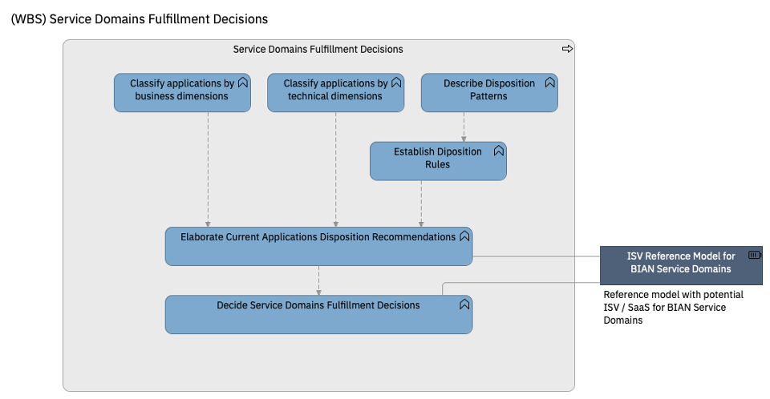

# Service Domain Fulfillment Decisions

Decide what disposition for the applications. Typical dispositions would be replace with and ISV, refactor the application, re-write the application (potentially on Cloud), etc.

Dispositions will be decided upon business and technical classifications of the applications.

| Task | Description |
|:--------------|:-------------------|
| **Classify applications by business dimensions** | The current applications or application components are classified according to Business Dimensions. These dimensions are a key input to the disposition decisions. |
| **Classify applications by technical dimensions** | The current applications or applications components are classified according to Technical Dimensions. These dimensions are a key input to the disposition decisions. The technical dimensions will be provided by the [application portfolio technical](application_portfolio_technical_analysis.md) analysis activity or they should be provided by the customer.|
| **Describe Disposition Patterns** | Disposition Patterns describes the different strategy that will be applied to each application or application components.|
| **Establish Disposition Rules** | Create a decision framework for dispositions based on business and technical dimensions |

# Task Descriptions

## Task: Classify applications by business dimensions

The current applications or application components are classified according to Business Dimensions. These dimensions are a key input to the disposition decisions.

* **Key Imperative for the Domain** Describes the primary (albeit non unique) objectives of the domain and what should be the used of the allocated budget. For example, customer services would focus on providing the best customer experience while payment processing would aim to maximum efficiency

    | Values | Description |
    |:--------------------|:---------------------------|
    | Customer | The primary objectives of applications supporting the domain would be to provide the best customer or user experience |
    | User Experience | The primary objectives of applications supporting the domain would be the cost efficiency |
    | Efficiency | The primary objectives of applications supporting the domain would be the cost efficiency |
    | Compliance | The primary objectives of applications supporting the domain would be assurance of compliance regulations |
    | Business Agility | The primary objectives of applications supporting the domain would be the time to market for new products and services or new product/services features |

* **Total Cost of Ownership (TCO)** Cost of application management: insfrascture cost + application management cost. Dimension Values:

    | Values | Description |
    |:--------------------|:---------------------------|
	| Low |  The TCO is below average in the Portfolio of applications |
    | Medium | The TCO is around average in the Portfolio of applications |
    | High |  The TCO is about average in the Portfolio of applications |
    
	
* **Business Value** Classification of the Business Application in terms of their importance in the Strategic objectives and achieving of the strategy and imperatives of the bank or bank unit. Dimension Values:

    | Values | Description |
    |:--------------------|:---------------------------|
	| Strategic Capability | They are applications provide differentating capabilities, for example a product matching application |
    | Utility |	Application not providing actual busines capabilities but only technical of fucntional services to other applications, for example a loging or a referenca data application |
	| Commodity	| Applications providing business capabililities which are not differentiating for the Bank, for example a payment order application |

* **Transformation Value** Classification of the application in terms on the impact in the Business Transformation Startegy. This dimension only applies in Business Transformation Scenarios and not in simple cost reduction scenarios. It measure whether an application is important to fulfill the business strategy and how far it is to support them. For example, an application supporting business processes in branches will be probably far from been able to support digital processes and, in consequence, may require to be completelly changed rather than modernized. Dimension Values:

    | Values | Description |
    |:--------------------|:---------------------------|
	| N/A |  The application is not relevant in the transformation |
    | Low Gap | The application is relevant and require minor changes (below 20% of functions impacted) |
    | Medium Gap | The application is relevant and require minor changes (20%-50% of functions impacted) |
    | Large Gap | The application is relevant and require mayor changes (above 50% of functions impacted) |

* **Capability Scope** Classification of the application according to the reusability of their business capabilities. For example, a "Customer Profile" application would provide enterprise-wide capabilites supporting any kind of product or service, while a "Card Authorization" will provide capabilities with much narrower scope, such as Card Products. Dimension Values:

    | Values | Description |
    |:--------------------|:---------------------------|
	| Enterprise Wide |  The application provide capabilities that can be shared accross all products and services, for example, a customer profiling, a product catalogue, a product potfolio analysis... |
    | Business Domain Wide | The application provide capabilities that can be shared accross all products and services of an specific domains (i.e. Credits), for example: risk anaysis, credit underwriting... but not to other products or services on other Business Domains |
    | Product Wide | The application provide capabilities only related to a specific product, for example: Card Authorization, Investment Account, Tax Payment... but not to other products or services |

## Task: Classify applications by technical dimensions

The current applications or applications components are classified according to Technical Dimensions. These dimensions are a key input to the disposition decisions. The technical dimensions will be provided by the [application portfolio technical](application_portfolio_technical_analysis.md) analysis activity or they should be provided by the customer.

Those are recommended technical dimensions to consider:

* **Size** Size of the application or component. Size is usually meassured in LOC (Lines of Code), which can be adjusted when dealing with applications in different technologies or lenguages. In each situation is important to have a "sizing" approach that allows to compare of applications independently of the their technology.
  
    | Values | Description |
    |:--------------------|:---------------------------|
	| Small |  The size is below 30% of the average size in the portfolio of applications |
    | Medium | The size is between 30%-70% of the average size in the portfolio of applications |
    | Large |  The size is above 70% of the average size in the portfolio of applications |
    

* **Internal Coupling** An estimation of the level of dependencies among components in the same application. 

    | Values | Description |
    |:--------------------|:---------------------------|
	| Small |  The number of internal interfaces is below 10% of total software elements of the application(programs, classess, .... depending on the technology) |
    | Medium | The number of internal interfaces is between 10%-30% of total software elements of the application |
    | Large |   The number of internal interfaces is above 30% of total software elements of the application |
    

* **External Coupling** An estimation of the level of dependencies with other applications. 

    | Values | Description |
    |:--------------------|:---------------------------|
	| Small |  The number of external interfaces is below 5% of total software elements of the application(programs, classess, .... depending on the technology) |
    | Medium | The number of external interfaces is between 5%-15% of total software elements of the application |
    | Large |   The number of external interfaces is above 15% of total software elements of the application |
    

* **Alignment Open Standards** The application follows open standard or deviate from them. For example, applications developed in Cobol, or java, versus application developed on proprietary lenguages. Also usage or dependencies with proprietary middleware, libraries... is considered deviation from open standard 

    | Values | Description |
    |:--------------------|:---------------------------|
	| Small |  More than 20% of software elements are not considered to follow open standards |
    | Medium | 5% -20% of software elements are not considered to follow open standards |
    | Large |  Less than 5% of software element are not considered to follow open standards |

   
* **Complexity** It meassures how easy or difficult is to understand and reproduce the code. This is usually provided by the code analysis tools using standard metrics.
  
    | Values | Description |
    |:--------------------|:---------------------------|
	| Small |  Small complexity as meassure by the selected complexity standard |
    | Medium | Medium complexity as meassure by the selected complexity standard |
    | Large | Small complexity as meassure by the selected complexity standard |
  

## Task: Describe Disposition Patterns

Disposition Patterns describes the different strategy that will be applied to each application or application components. Followings are proposed disposition patterns:

| Disposition Pattern	| Description | Modernization Patterns |
|:--------------------|:---------------------------|:---------------------------|
| Retain | No major changes to existing applications have to be done. But in some cases due to the refactor of other SPI Groups, it could be necessary to include some changes.	| |
| Refactor | Improve the technical or functional characteristic without a technology change. The application is decomponentized to a higher degree and some components may even be replaced or rewriten in different technical platforms but most of the application remanins un touched and there won´t be mayor data migrations | API Enable   Componentize   Cloud Native |
| Re-Architecture (Modernize) |Re-design the existing applications to cloud, including business process re-invention | Cloud Native    COTS / SaaS |
| Rationalize (Consolidate) | Migrate the functionality to another solution in the bank to create enterprise or business unit wide capabilities   Requires a consolidation decision: which is the target solution? Does the target solution require transformation? | |
| Retire | Application is decommissioned due to lack of use or purpose | |
| Re-platform | Moving applications to the cloud without major changes, but taking advantage of benefits of the cloud environment. | |

## Task: Establish Disposition Rules

Create a decision framework for dispositions based on business and technical dimensions

* **Guidance** [Create Disposition Rules](guidance/create_disposition_rules.md) 

## Task: Elaborate Current Applications Disposition Recommendations

Applies the disposition rules to the service domains and decide the dispositions. Document the dispostion decisions.

