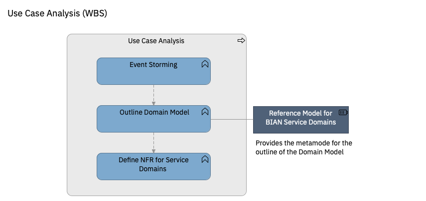

# Use Case Analysis

| Task | Description |
|:--------------|:-------------------|
| **Event Storming** | The actors and roles that will participate in the new process are identified, as well as the most relevant situations or use-cases in which they are involved. Each role is accompanied by a diagram containing the business activities in which it participates or for which it is responsible. Each business activity is linked to a service domain within the domain model. This service domain is responsible for providing the services necessary to support that business function. It is therefore the owner of that business function.   Creation and validation of the Domain Model by analyzing the processes identified in the Customer Journey and using BIAN as the reference model. The domain design will be done using a meta-model based on the DDD elements. The design of the domains is done by defining the aggregate structures and the life cycles of the entities. The aggregate is the fundamental element to describe the domain model. The aggregates support the business capabilities of the service domain. Event storming is the technique used for the analysis of each of the domains.     Sub-tasks:    * **Identify Actors.** The actors and roles that will participate in the new process are identified, as well as the most relevant situations or use-cases in which they are involved. Each role is accompanied by a diagram containing the business activities in which it participates or for which it is responsible. Each business activity is linked to a service domain within the domain model. This is responsible for providing the services necessary to support that business function. It is therefore the owner of that business function * **Perform Event Storming Workshop**    * **Identify Business Events**    * **Identify Service Domains & Aggregates**    * **Identify APIs and Event Agents**   
| **Task: Outline Domain Model** | Creation and validation of the Domain Models by analyzing the processes identified in the Customer Journey and using BIAN as the reference model. The domain design will be done using a meta-model based on the DDD elements. The design of the domains is done by defining the aggregate structures and the life cycles of the entities. The aggregate is the fundamental element to describe the domain model. The aggregates support the business capabilities of the service domain.      Sub-tasks:   * **Describe Required APIs**  * **Describe Incoming Business Events**   * **Describe Event Agent**   * **Describe Aggregates** |
| **Define Non-Functional Requirements (NFR) for Service Domains** | NFR are specially important when designing cloud applications. The technical characterists of cloud environment are very different from the ones provide by traditional platforms such as Mainframe or Application Servers. In legacy platforms most NFR such as availability or performance are mostly assured by the platform itself and the monolith architecture style.    In Cloud, specially in hybrid multi-cloud, this scenario changes; latency increases because of the use of APIs and because the availability of a resource or a service should not be considered as a given.   In this scenario, NFR will provide guidelined constrains to developers and designers to ensure that NFR can be met in the most efficient way. For example, a critical service will never call APIs in non-critical services without failsafes, because it would mean that the non-critical service becomes critical and, in consequence, more expensive. Also services with very strict performance or response time NFR won´t be allow to use synchronous calls to other services, and the designer would have to consider other integrations patterns. These constraints can only be enforced after a proper definition of NFR for the different service domains.       Sub-tasks:   * **Design NFR Definition Framework** Design a framework to describe and manage the non-functional requirements for business analysts and developers when designing target application architectures for Cloud, in Banking transformation programs. The main objectives of this framework could be summarized as:   * Identify and state a common understanding on the NFR that are relevant for the development of the Distribution Layer in particular, and the transformation program in general.   * Provide the necessary guidelines to the business analysts to identify and specify the non-functional requirements for every component (micro-service) in the target architecture. This will be done, when possible, based on pre-established levels (such as Gold, Silver, Bronze or Level 1, 2, 3, High/Low Criticality…). For example, for a micro-service that is used constantly in digital channels, the NFR for availability could be gold, while for a micro-service to maintain the product pricing, which is rarely used and by few users, the requirement will be Bronze.  * Provide the necessary guidelines to help system engineers / developers to design components (microservices) that meets each desired level of NFR. For example, “a microservice which have a gold requirement for availability, cannot depend on other components with lover level of availability and, in consequence will not consume APIs from such components without proper circuit breaker mechanisms”.  * **Define NFR for Service Domains** Apply the framework to define the NFR for each of the Service Domains|

**Guidance**
* [Identifying the proper BIAN Service Domain during an Event Storming](guidance/bian_service_domains_identification.md)** (PENDING)
* [Guidance: Metamodel for Service Domain Design](https://pages.github.ibm.com/BIAN-AOT-Initiative/bian-based-reference-domain-model/domain_models/model_metamodel/)

* [Tool Mentor: Design Service Domains in Archimate](assets/documents/domain_models_specification_with_archimate_tool_guidance.docx)
* [Workproduct Template: Domain Design](assets/documents/domain_models_specification_template.docx)

* [Guidance: NFR Specification for Native Cloud Complex Solutions](assets/documents/nfr_framework_for_cloud_native_complex_applications.doc)

