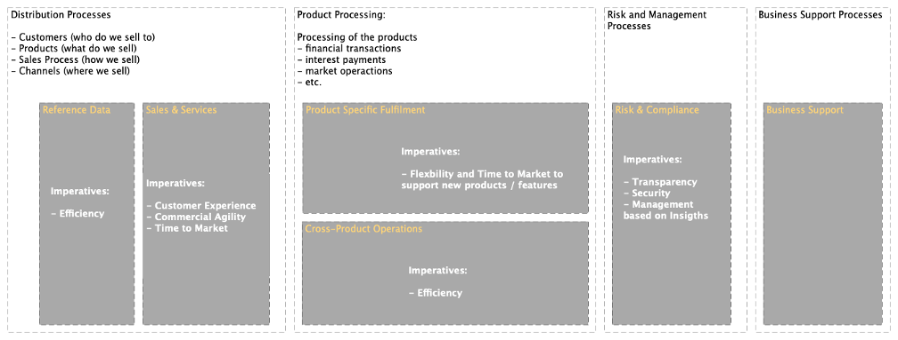
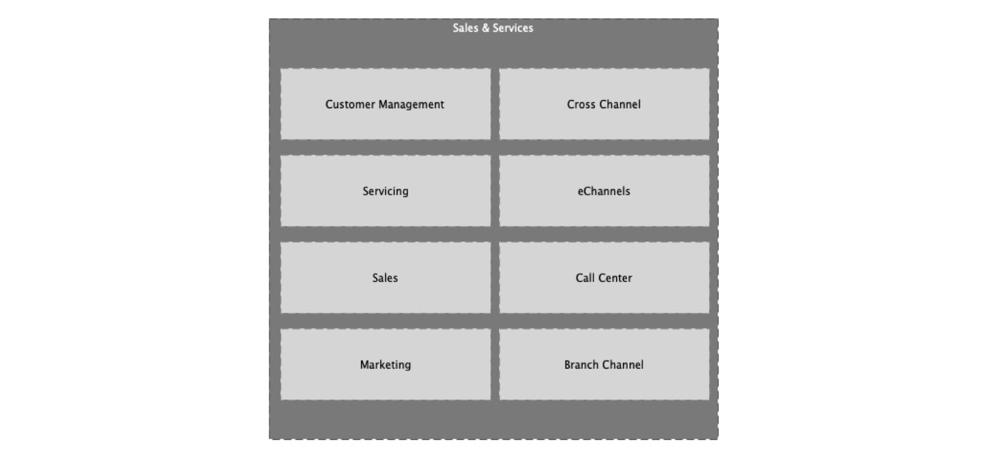
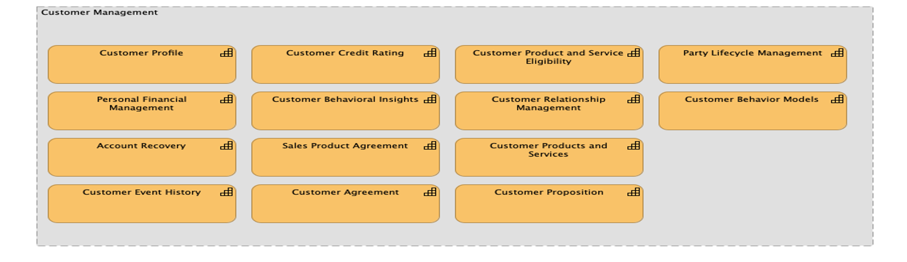
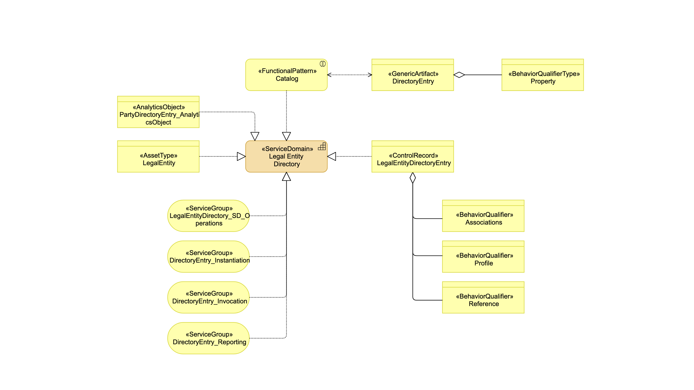

# Service Landscape - Workproduct - 

BIAN based target arquitectures are structured on Service Domain (SD). The Service Landscape workproduct describes the Service Domains that composes the target solution. The service domains are identified from the business requirements, business process analsysis, or through the functional analysisi of the current systems. The Services Domains are selected from BIAN Service Landscape. BIAN service landscape can be specialized. For example, from "Service Product" we may have different service domains identified from specialization such as "National Tax Payments", "Local Tax Payment", etc.

See example in BIAN:

[BIAN 9 Service Landscape, Value Chain View](https://bian.org/servicelandscape-9-1/views/view_30838.html)
[BIAN 9 Service Landscape, Matrix View](https://bian.org/servicelandscape-9-1/views/view_30526.html)

>
> These examples are from BIAN version 9.1. Once in BIAN website, you can find the most updated version of the Service Landscape
>

The SDs as grouped into Business Areas and Business Domains.

### Business Areas

Banking Processes are usually complex processes, where different actors intervene and where each actor has very different objectives to fulfill: there are commercial processes with client managers who wants to sell products, customers who need financing, deposits or manage investments but wants requests to be resolved quickly and in the simplest way; there are risk managers whose imperative is that the operation complies with the established Risk Policies; there are legal and internal audit departments obsessed that the signed contract is valid and does not give problems in the future; back office manager, who seeks to process operations at the lowest possible cost; a regulatory compliance officer who does not want sanctions on the bank for non-compliance; and so on.
How is it possible to reconcile such disparate and often conflicting interests in a single process? Who is the owner of each process? Can someone who design a process really put himself in the shoes of all the actors or is he always going to favor the objectives of one of the parties? 

The Business Areas structure the business capabilities in large blocks in the value chain. Business Areas must be very independent from each other because each area has different business priorities and imperatives and requires very different skills. No teams should own responsibilities in more than one area. Dependencies between applications in different area should be minimal to none.

The following diagram includes the business areas according to BIAN v9 and enumerates the different business imperatives that each business area usually aims.

### Business Domain.

Service Domains are grouped in Business Domains. They represent responsibility groups, which provide similar related capabilities so that teams can specialize in specific knowledge areas, and which share a common business language. They represent a reference model for possible IT reorganizations. For practical purposes, you should have a single head of the IT organization

Business Domains subdivide the areas into groups of domains that provided related business capabilities and share a Common Business Language, SMEs and IT Development Teams. 

For practical purposes, they should be owned by a single manager within the IT organization (and desirably, within a business units)

While the business areas will usually follow the model proposed by BIAN, the Domains will differ greatly, to adapt to the reality of each Financial Institution.

The IT organization should be designed to meet the business domains models, with different team assigned to different domains. The teams can them specialize in specific knowledge the domains require.

### Service Domain

Business Domains are structured in Service Domains. Each Service Domain has a unique business purpose, are elemental (not composed of other Service Domains), and collectively comprehensive (any business activity can be model using Service Domains).

Services Domains that implement business capabilities under the principle of single business responsibility. They expose the business capabilities using APIS or public business events. Interactions and collaborations are implemented between service domains, while business domains remains an organization and governance element.

Service Domains are implemented, integrated, deployed and/or consumed as Self-Contain Systems. They provide business capabilities exclusively through standard API and Business Events. A Service Domain can be implemented using any kind or combination of technical solution, from application servers, BPMaaS, IA solutions, etc. Service Domains do not share data nor transactional contexts with other domains.

SD are be described through:

- A Description of the responsbilities
- A Functional Pattern
- A Control Record

This information can be found in BIAN, and can be customized for your target solution, enhancing the base information provided by the BIAN model. In BIAN, every SD has an overview diagram where you can find such information. For example:

In the diagram you can find the functional pattern and the control record

