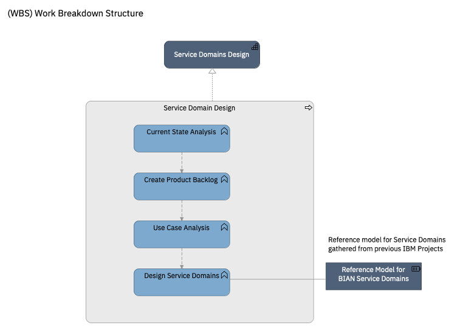

# Practice: Service Domain Design (Practice)

**Overview**

This practice describes how to design service domains following Domain Driven Design and the BIAN standard. This practice transforms business requirements into a technology-agnostic domain design that can later be implemenented using different technologies, but with the right caracteristics of modularity and integration patterns to be deployed in a hybrid multi-cloud. This practice is usually applied in Macro Design stages of Delivery phase.

| Activity | Description |
|:--------------|:-------------------|
|[Current State Analysis](activities/current_state_analysis.md)| |
|[Create product backlog](activities/create_product_backlog.md)| | 
|[Use case analysis](activities/use_case_analysis.md)| Creating a Use Case Backlog and a Use Case Analysis can be replaced with [Business Use Case Modeling Practice in GBS Method (access requires VPN)](https://methodworkspace-prod.dal1a.cirrus.ibm.com/search?pracName=Business_Use_Case_Modeling&pracType=CapabilityPattern) where more details instructions may be provided. The key difference included is the use of Event Storming technique for the analysis of the use cases, versus the more traditional approach for use case modelling.|
|[Design Service Domains](activities/design_service_domains.md)| |

