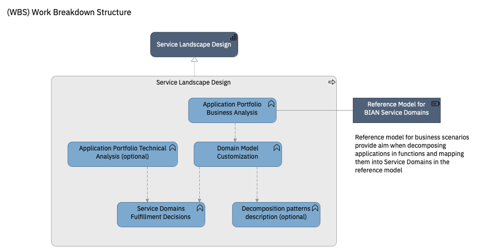

# Service Landscape Design (Practice)

**Overview:**

This practice deals with designing the Service Domain Landscape as the Target Stage Solution in Banking Transformations by analyzing current applications and business processes with a reference model of the banking industry, [BIAN](http://www.bian.org). It details the analysis and design methodology, and describes the most common findings and recommendations that are originated in this kind of projects. Defining the transformation strategies of the different systems against BIAN allows the identification of business opportunities based on business capabilities described in the model that are not currently available in the legacy applications; opportunities to improve efficiency by identifying redundant functions; opportunities to evolve from product-oriented models to business domain models that allow the objectives and imperatives of the many and very different stakeholders in business processes to be adequately resolved.

The Target State Solution will also suggest important changes on the IT organization itself, from teams built around technical skills and technical platforms, to teams build around business capabilities.
The Target State Solution is defined by a domain model, the structure of which is described in the first chapter.

| Activity | Description |
|:--------------|:-------------------|
|[Application Portfolio Business Analysis](activities/application_portfolio_business_analysis.md) | The existing applications are mapped to the service domains in the reference model. Usually each application maps to several domains in the model according to the different business functions supported by the application.|
|[Application Portfolio Technical Analysis](activities/application_portfolio_technical_analysis.md) | Using analysis tools, the source code components are **clustered** and mapped to business functions identified in the business analysis. Technical metrics and information is provided by the analysis tools such as complexity, size (i.e lines of code), number and type of interfaces with other clusters. This information will be used later as part of the criteria to decide the disposition strategies for each component and, more importantly, to estimate the effort and risk of the transformation project required.|
|[Domain Model Customization](activities/domain_model_customization.md) | The reference model is customized for the customer based on:   - business activities provided by the application portfolio   - customer business organization   - customer business model |
|[Decomposition patterns description](activities/decomposition_patterns_description.md)| The business analysis mapping of applications into business functions and into services domains in the reference model will show repeatible patterns, which can be identified and described for further aid in the analysis or designs of new applications. |
| [Service Domain Fulfillment Decisions](activities/service_domain_fulfillment_decisions.md) | The target solution consists on the Service Domains described in the Service Landscape. Each service domain will be implemented using different approaches, such as using a SaaS or commercial package, by developing new custom application, refactoring or retaining existing ones. These activities will provide fulfillment recommendations for each of the Service Domains in Scope. |

# Guidance

* [Developing BIAN-based Service Landscape](assets/documents/service_landscape_design_guidance.pdf)

